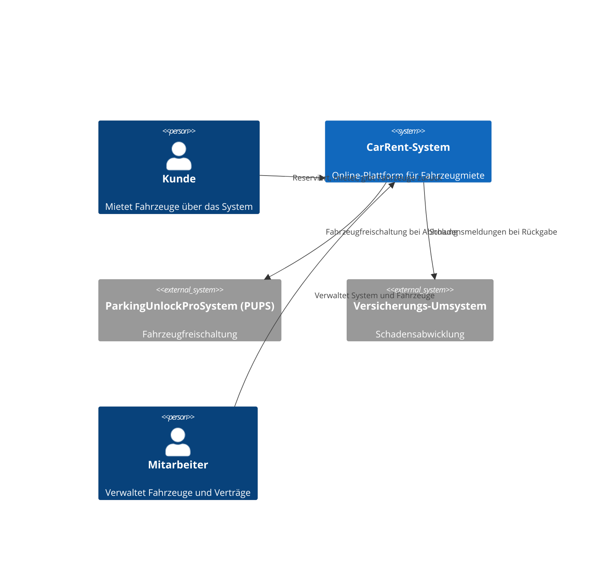

# Context and Scope

## Business Context

Das CarRent-System interagiert mit verschiedenen Akteuren und externen Systemen. Die folgende Grafik zeigt die wichtigsten Beziehungen:

Das CarRent-System steht im Zentrum und verbindet Kunden, Mitarbeitende und externe Systeme für einen reibungslosen Mietprozess.

## Technical Context

Das System wird als Webanwendung mit Backend und Datenbank betrieben. Externe Schnittstellen werden über APIs angebunden.
