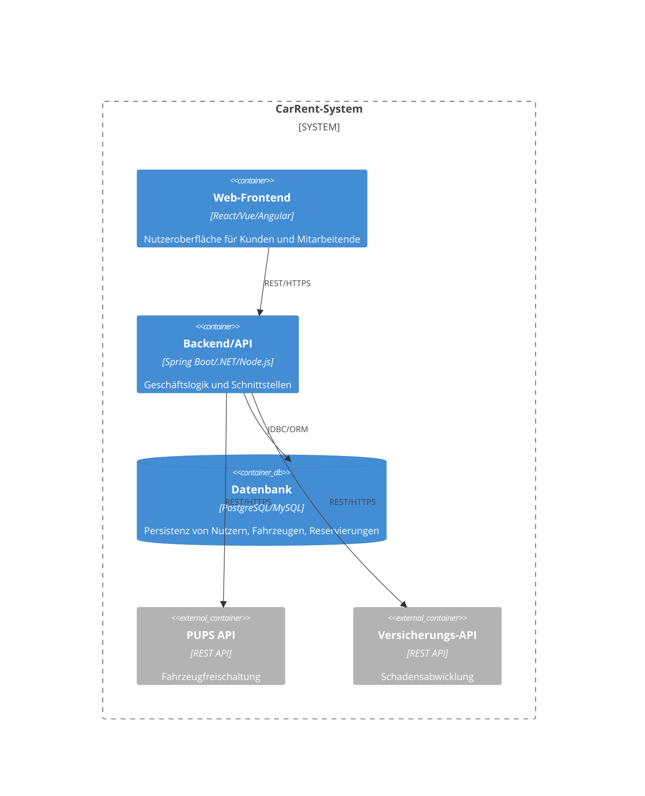

# Building Block View

## Whitebox Overall System

Das CarRent-System besteht aus mehreren Containern, die jeweils eine zentrale Aufgabe übernehmen. Die folgende Grafik zeigt die wichtigsten Container und deren Beziehungen:

Die Containerstruktur ermöglicht eine klare Trennung von Präsentation, Logik und Persistenz sowie die Anbindung externer Systeme.

## Level 2

### White Box *\<building block 1>*

*\<white box template>*

### White Box *\<building block 2>*

*\<white box template>*

…

### White Box *\<building block m>*

*\<white box template>*

## Level 3

### White Box \<\_building block x.1\_\>

*\<white box template>*

### White Box \<\_building block x.2\_\>

*\<white box template>*

### White Box \<\_building block y.1\_\>

*\<white box template>*
